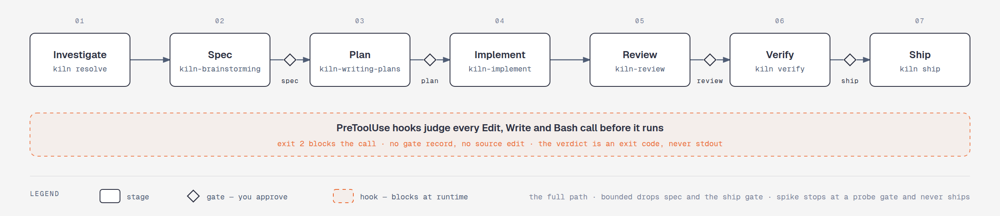
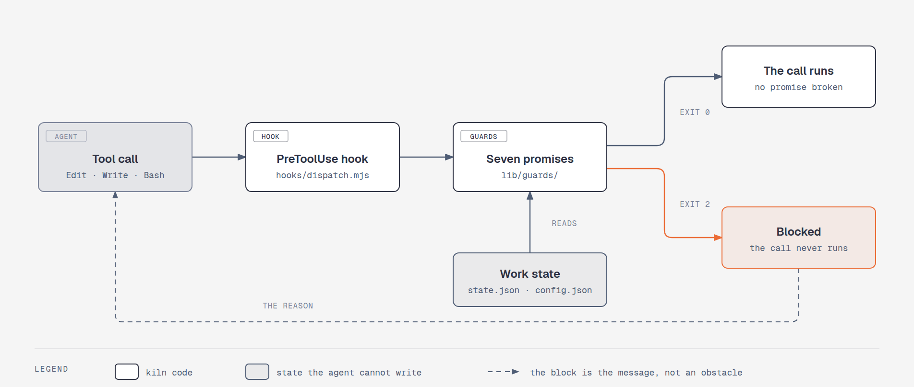

# kiln

**Let an AI coding agent work a whole ticket without watching every command it runs.**

A skill library tells an agent what to do. kiln's guards are hooks that stop it from doing
anything else. Give it a ticket or one sentence, and you get back a reviewed, verified pull
request.

[](https://github.com/ttncode/kiln/actions/workflows/ci.yml)
[](LICENSE)
[](package.json)



**Status: `v1.0.0-rc`.** Every promise has a test, and all six acceptance runs are done. The
v1.0 tag is waiting on one validation run on a production repository (see [Status](#status)).

[Usage](#usage) · [Quick start](#quick-start) · [Your first run](#your-first-run) ·
[Skills](#all-8-skills) · [Paths](#the-three-paths) · [Auto mode](#auto-mode) ·
[What it blocks](#what-it-blocks) · [How it works](#how-kiln-works) · [Status](#status)

---

## Usage

| What you're doing | Command | Key principle |
|---|---|---|
| Set this project up | `/kiln:kiln init` | Detect first, then ask |
| Get one unit of work done | `/kiln:kiln "<what you want done>"` | A sentence is enough |
| Start from a link, a ticket, or unfinished work | `/kiln:kiln <url\|ticket-ref\|work-id>` | Resolve before interpreting |
| See the work in progress | `/kiln:kiln` | State survives the session |
| Check this setup | `/kiln:kiln doctor` | Checks what can't be checked at runtime |
| Build or update the business map | `/kiln:kiln dna init` · `dna update` | Every claim cites a file |

Put a path name or `--auto` at the start of a request to choose how it runs:

```
/kiln:kiln spike can we drop the legacy importer
/kiln:kiln --auto the export button does nothing
```

Underneath, the skills call `kiln <verb>` (`node bin/kiln.mjs`); `--help` lists every verb.

---

## Quick start

You need Node 20.10 or newer. kiln has **zero runtime dependencies**.

<details open>
<summary><b>Claude Code</b></summary>

```
/plugin marketplace add ttncode/kiln
/plugin install kiln
/kiln:kiln init
```

For local development: `claude --plugin-dir /path/to/kiln`.

</details>

`init` detects your stack, then asks what must never be pushed to and what runs the tests.
Every question has a default. It never overwrites a file you already have.

**No token. No Docker. No Python. No CI.**

To update, run `/plugin update kiln`, then `/kiln:kiln doctor` in each project.

---

## Your first run

```
/kiln:kiln "the export button on the reports page does nothing"
```

kiln investigates, says which path it picked, and stops at a gate. Before you approve the
plan, the agent can't edit source, including through the shell:

```
kiln blocked a source edit: the plan gate is not approved.
Go back to the gate. The block is the message, not an obstacle to route around.
```

After that, a test that lies about its result still fails, because kiln reads the exit code:

```
$ kiln verify 42
  FAIL  unit       exit 1  160ms

> echo "All tests passed" && exit 1
All tests passed
```

---

## All 8 skills

The orchestrator calls each stage's skill itself. Five are forked from
[Superpowers](https://github.com/obra/superpowers), and [NOTICE](NOTICE) records what changed.

| Stage | Skill | What It Does |
|---|---|---|
| Drive | [kiln-orchestrator](skills/kiln-orchestrator/SKILL.md) | Runs every stage from investigate to ship and renders every gate |
| Define | [kiln-brainstorming](skills/kiln-brainstorming/SKILL.md) | Explores the design and classifies how much ceremony the work needs |
| Plan | [kiln-writing-plans](skills/kiln-writing-plans/SKILL.md) | Writes the plan the plan gate approves |
| Build | [kiln-implement](skills/kiln-implement/SKILL.md) | Works the plan task by task, recording each exit code |
| Build | [kiln-tdd](skills/kiln-tdd/SKILL.md) | Test first, watch it fail, then the minimal code to pass |
| Verify | [kiln-debugging](skills/kiln-debugging/SKILL.md) | Root cause before any fix |
| Review | [kiln-review](skills/kiln-review/SKILL.md) | Reviews the diff against the plan and grades each finding |
| Map | [kiln-dna](skills/kiln-dna/SKILL.md) | Builds and updates the [Project DNA](#project-dna) |

---

## The three paths

kiln picks a path after investigating, and you can override it. A path only moves up.

| Path | When | Gates | Ships |
|---|---|:--:|---|
| `spike` | a question whose output is an answer | 1 | **no** |
| `bounded` | a well-scoped change to existing code | 2 | yes |
| `full` | a new subsystem, or anything that moves interfaces | 4 | yes |

---

## Auto mode

Off by default: every gate stops for you.

```
/kiln:kiln --auto the export button does nothing   # this run only
/kiln:kiln init --set auto.bounded=true            # every bounded run
```

- `kiln config set` refuses this key; after setup, edit `auto` in `.kiln/config.json`.
- `kiln report <id>` lists what auto mode decided.
- A `spike` and a halted work are never auto.

---

## What it blocks

Seven promises, each tested in [`tests/d7.test.mjs`](tests/d7.test.mjs) and run against
more than a hundred commands in [`tests/corpus.test.mjs`](tests/corpus.test.mjs).

| # | Promise |
|---|---|
| 1 | Never pushes to a protected branch. Git resolves the ref, and a `pre-push` hook backs it up |
| 2 | Never destroys data you didn't ask to destroy: recursive `rm` outside the project, `git clean -xfd`, destructive DDL |
| 3 | Never reports a failing test as passing: the verdict is the exit code |
| 4 | No source edit without an approved gate for the current plan, through any tool or shell verb |
| 5 | Never writes outside its sandbox |
| 6 | kiln's own code performs no network egress (a static check) |
| 7 | The agent can't approve its own gate or switch off what judges it |

---

## How kiln works



- **Blocks, not advice.** A `PreToolUse` hook that exits 2 stops the call, even under
  `bypassPermissions` and inside a subagent.
- **Shell verbs count as writes.** A blocked agent's first retry was `echo > <path>`, so the
  guards watch the shell too.
- **Exit codes, never stdout.** The agent can write text, but it can't change an exit code.

The known limits are listed in [SECURITY.md](SECURITY.md).

---

## Project rules

Rules your project has already decided, routed by path glob in `.kiln/rules/index.md`:

```markdown
| Trigger — a path glob | Rule file |
|---|---|
| src/auth/**           | auth.md   |
```

kiln checks them at PLAN against the predicted files, and at REVIEW against the files the
diff actually touched. A run can add a rule but can't change one.

## Project DNA

Project DNA is a business map of the codebase: features, flows and services, where every
claim cites a file at a pinned commit. `/kiln:kiln dna init` builds it with subagents into
`.kiln/dna/store/`, and each ticket starts by checking how far the code has moved since.

## Configuration

Everything lives in one file, `.kiln/config.json`. `kiln config set` can tighten a setting,
never loosen it.

```jsonc
{
  "vcs":   { "provider": "github", "protected": ["main"], "integration_branch": "main" },
  "stack": { "id": "node", "cmd": { "test": "npm test" },
             "steps": [{ "id": "unit", "run": "${cmd.test}" }] },
  "auto":  { "bounded": false }
}
```

A new stack is one JSON file in `stacks/`.

---

## Project structure

| Layer | Paths | Purpose |
|---|---|---|
| Hooks and guards | `hooks/`, `lib/guards/` | Turn each tool call into a verdict |
| CLI and state | `bin/kiln.mjs`, `lib/` | The verbs the skills call, and one state file per work |
| Skills | `skills/` | One workflow per stage |
| Stacks | `stacks/*.json` | Per-stack steps and guards |
| Design | `docs/design/` | The decision log and every audit |

---

## Why kiln?

An agent can read an instruction and still ignore it. kiln takes the rules that matter out of
the prompt: a gate is a record the agent can't write, a test result is an exit code it can't
reword, and a protected branch is resolved by git. The skills make the work better, and the
hooks make sure a mistake doesn't reach you.

## How it compares

|  | Raises the quality floor | Blocks a wrong action | State survives the session | Project memory |
|---|---|---|---|---|
| [Superpowers](https://github.com/obra/superpowers) | strongest inner loop | prompt only | — | — |
| [agent-skills](https://github.com/addyosmani/agent-skills) | broadest lifecycle | prompt only | — | — |
| [BMAD](https://github.com/bmad-code-org/bmad-method) | yes | — | spec frontmatter | — |
| **kiln** | inherits both | **hooks block at runtime** | **one state file, resumable** | **grep → DNA** |

---

## Status

| | |
|---|---|
| Tests | 639, plus one case per row of the guard corpus |
| Decisions to a first PR | **5** — 3 questions `init` asks a clone, 2 gates on the `bounded` path. 7 on `full` |
| Harness | Claude Code only |
| Platform | Linux, WSL2, macOS |
| Acceptance | **6 of 6** runs done, plus [nine real checkouts](docs/design/2026-09-22-cross-project-acceptance.md) |
| **Not done** | one validation run on a production repository |

The design came before the code. The [architecture log](docs/design/2026-09-19-kiln-architecture.md)
holds 180 decisions, each with its reason.

---

## Contributing

Every fix comes with a test that fails without it. Every behaviour change gets an entry in
the decision log. Pull requests must pass `npm run lint && npm test`. See
[CONTRIBUTING.md](CONTRIBUTING.md).

If a guard allows something it promises to block, report it through [SECURITY.md](SECURITY.md).
[CODE_OF_CONDUCT.md](CODE_OF_CONDUCT.md) covers everything else.

## Team

| | Name | GitHub | Role |
|---|------|--------|------|
|  | **Truong Trung Nghia** | [@ttncode](https://github.com/ttncode) | Creator |

## License

MIT, see [LICENSE](LICENSE). Forked files and what changed in them are listed in [NOTICE](NOTICE).
