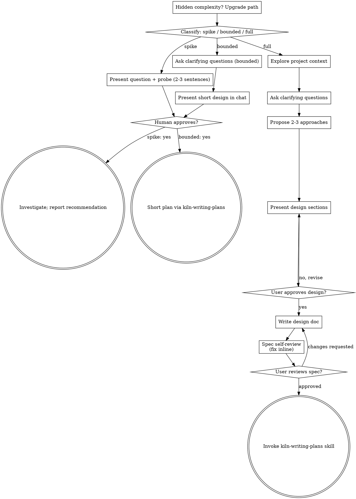

# Brainstorming Ideas Into Designs

Help turn ideas into fully formed designs and specs through natural collaborative dialogue.

Start by classifying how much process the request needs, then work
through your path: understand the context, refine the idea, present a
design, and get your human partner's approval.

## Establish Shared Understanding

The outcome of brainstorming is an understanding your human partner can
recognize and correct, grounded in what they want to accomplish.

1. **Discover intent.** Use the request and available context to identify
   the intended outcome, who it is for, and what success looks like. When
   that information is missing, ask one focused question about purpose or
   intended use before proposing features or an approach. Knowing the app
   genre does not tell you why your partner wants it. Gathering missing
   requirements does not ask them to authorize the task again.
2. **Write back your understanding.** Summarize the intended outcome,
   relevant constraints, and success criteria in a short note your partner
   can assess. Separate what they said from assumptions. Invite correction
   and incorporate their answer before treating this as the design brief.
3. **Carry intent into the design.** Preserve the agreed understanding in
   the selected path's design artifact: the written spec for full
   work, or the in-chat design/probe for bounded work and spikes. Check
   proposed features and technical choices against that understanding.

When the request already supplies the purpose and constraints, reflect
that understanding instead of asking the same questions again. Keep the
note concise; its accuracy and the opportunity to correct it matter.

<HARD-GATE>
Before taking any implementation action, including invoking an
implementation skill, writing product code, scaffolding, installing
product dependencies, or creating an external project, complete the
selected path's prerequisites:

- Spike: the human partner approves the question and probe at the
  `probe` gate — an explicit yes, recorded by kiln.
- Bounded: the human partner agrees the short in-chat design; the plan
  gate then records their approval of the short `plan.md` that
  kiln-writing-plans writes from it.
- Full: the human partner reviews and approves the written spec at the
  `spec` gate, then the written plan at the `plan` gate. Conversational
  design approval only permits writing the spec; written-spec approval
  only permits invoking kiln-writing-plans.

A reply approves the stage actually presented. Approval of an idea or
feature scope does not approve artifacts that do not exist yet. Resume
at the earliest incomplete stage; do not turn one approval into permission
to skip the rest of the selected path. Read-only project exploration is
allowed while those prerequisites remain incomplete.
</HARD-GATE>

## Three Paths

kiln classifies at the end of INVESTIGATE, and says it out loud so your
human partner can override it — usually before this skill is invoked.
If what you learn here changes the path, say so and let the orchestrator
ratchet it up:

- **Spike** — a feasibility question ("can we...", "is it possible...",
  "quick and dirty is fine") whose output is an answer, not code you
  keep. Present the question and what you'll try in 2-3 sentences, get
  an explicit yes at the probe gate, then find out as cheaply as correctness allows. No design
  doc, no spec file. Report findings as a recommendation; anything you
  built stays labeled throwaway.
- **Bounded** — a well-scoped change to code that already exists in
  this repo: a new flag, a small endpoint, a one-file fix.
  Understanding the kind of app is not enough — bounded means the flow
  you are changing is already here to read. If there is no existing
  flow to change, the task is not bounded. Ask the clarifying
  questions that matter, present a short design IN CHAT (a few
  sentences to a few short paragraphs), and STOP. Implementation
  starts only after the plan gate — a bounded task's approval is as
  hard a gate as the full path's. No spec file; kiln-writing-plans turns
  the agreed design into a short `plan.md`, and that is what the plan
  gate approves.
- **Full** — new projects, new subsystems, changes that
  restructure how components fit together or alter interfaces others
  depend on. Follow the full process: questions, approaches, sectioned
  design, written spec, then the kiln-writing-plans skill.

When in doubt between two paths, take the heavier one. The ratchet is
one-way: hidden complexity discovered mid-task upgrades the path —
stop, say so, and step up. Nothing downgrades mid-task.

## The written spec gets a reader who did not write it

On the full path, before the spec gate:

```
Task(subagent_type: "general-purpose", prompt: <the template in spec-document-reviewer-prompt.md, filled in>)
```

[spec-document-reviewer-prompt.md](spec-document-reviewer-prompt.md) is that prompt. It came
with this skill and nothing referenced it, so no spec was ever read by anyone but its author
— and the spec is what the plan, the implementation and the review all stand on.

Bring what comes back to the gate with the spec. A gate that hides a reviewer's objection is
asking for an approval of something the user was not shown.

## Anti-Pattern: "Too Simple To Need Approval"

Every path ends with your human partner approving the required design
before implementation. A bounded change may need only two sentences in
chat. A new todo-list project takes the full path and requires the written
spec and planning handoffs. Scale the artifact to the selected path;
complete that path's reviews before implementation.

## Red Flags

| Thought | Reality |
|---------|---------|
| "This is too simple to need a design" | Follow the selected path: a bounded change gets a short chat design; a full-path change gets the written spec and planning handoffs. |
| "I'll call it bounded and skip the spec" | Reaching for a label to skip work IS the doubt — take the heavier path. |
| "It's bounded and the design is obvious — I'll start while they read it" | The gate is the approval, not the design's length. Present, then stop until you hear yes. |
| "I understand this kind of app, so it's bounded" | Bounded measures the repo, not your familiarity. A new project has no existing flow — it takes the full path. |
| "The spike works, so I'll keep the code" | A spike's output is an answer. Keeping the code is a new request — classify it. |
| "It grew, but I'm almost done — no need to re-classify" | Hidden complexity upgrades the path mid-task. Stop and say so. |
| "They approved the spike, so the follow-up change is approved too" | Each task gets its own classification and its own approval. |

## Checklist

Classify first, announce the path, then create a task for each item on
your path and complete them in order.

**Spike:**
1. **Explore project context** — enough to frame the probe
2. **Present question + probe plan** — 2-3 sentences
3. **Get approval** — an explicit yes, recorded at the probe gate
4. **Investigate** — as cheaply as correctness allows
5. **Report findings** — a recommendation; label anything built as throwaway

**Bounded:**
1. **Explore project context** — check files, docs, recent commits
2. **Ask clarifying questions** — one at a time, the ones that matter
3. **Present short design in chat** — approach, files touched, testing
4. **Get approval** — STOP and wait for an explicit yes; presenting the design and starting in the same breath is skipping the gate
5. **Write the plan** — invoke kiln-writing-plans for a short `plan.md`; implementation starts after the plan gate

**Full:**
1. **Explore project context** — check files, docs, recent commits
2. **Offer the visual companion just-in-time** — NOT upfront. The first time a question would genuinely be clearer shown than described, offer it then (its own message); on approval its browser tab opens for you. If no visual question ever arises, never offer it. See the Visual Companion section below.
3. **Ask clarifying questions** — one at a time, understand purpose/constraints/success criteria
4. **Propose 2-3 approaches** — with trade-offs and your recommendation
5. **Present design** — in sections scaled to their complexity, get user approval after each section
6. **Write design doc** — save to `.kiln/work/<id>/spec.md`; kiln commits it at SHIP, not here
7. **Spec self-review** — quick inline check for placeholders, contradictions, ambiguity, scope (see below)
8. **User reviews written spec** — ask user to review the spec file before proceeding
9. **Transition to implementation** — invoke the kiln-writing-plans skill to create the plan

## Process Flow



**Terminal states are path-bound.** Full: the ONLY skill you
invoke after brainstorming is kiln-writing-plans — never frontend-design,
mcp-builder, or any other implementation skill. Bounded: after the
design is agreed, kiln-writing-plans writes a short `plan.md` for the
plan gate. Spike: the terminal state is a reported recommendation.

## The Process

The subsections below serve the bounded and full paths (a
spike stops at "present the probe, get an explicit yes"). Sections from
**Exploring approaches** onward are full-path depth — for
bounded work, context plus a few questions plus a short in-chat design
is the whole process.

**Understanding the idea:**

- Check out the current project state first (files, docs, recent commits)
- Before asking detailed questions, assess scope: if the request describes multiple independent subsystems (e.g., "build a platform with chat, file storage, billing, and analytics"), flag this immediately. Don't spend questions refining details of a project that needs to be decomposed first.
- If the project is too large for a single spec, help the user decompose into sub-projects: what are the independent pieces, how do they relate, what order should they be built? Then brainstorm the first sub-project through the normal design flow. Each sub-project gets its own spec → plan → implementation cycle.
- For appropriately-scoped projects, ask questions one at a time to refine the idea
- Prefer multiple choice questions when possible, but open-ended is fine too
- Only one question per message - if a topic needs more exploration, break it into multiple questions
- Focus on understanding: purpose, constraints, success criteria

**Exploring approaches:**

- Propose 2-3 different approaches with trade-offs
- Present options conversationally with your recommendation and reasoning
- Lead with your recommended option and explain why
- YAGNI ruthlessly - remove unnecessary features from every approach and design

**Presenting the design:**

- Once you believe you understand what you're building, present the design
- Scale each section to its complexity: a few sentences if straightforward, up to 200-300 words if nuanced
- Ask after each section whether it looks right so far
- Cover: architecture, components, data flow, error handling, testing
- Be ready to go back and clarify if something doesn't make sense

**Design for isolation and clarity:**

- Break the system into smaller units that each have one clear purpose, communicate through well-defined interfaces, and can be understood and tested independently
- For each unit, you should be able to answer: what does it do, how do you use it, and what does it depend on?
- Can someone understand what a unit does without reading its internals? Can you change the internals without breaking consumers? If not, the boundaries need work.
- Smaller, well-bounded units are also easier for you to work with - you reason better about code you can hold in context at once, and your edits are more reliable when files are focused. When a file grows large, that's often a signal that it's doing too much.

**Working in existing codebases:**

- Explore the current structure before proposing changes. Follow existing patterns.
- Where existing code has problems that affect the work (e.g., a file that's grown too large, unclear boundaries, tangled responsibilities), include targeted improvements as part of the design - the way a good developer improves code they're working in.
- Don't propose unrelated refactoring. Stay focused on what serves the current goal.

## After the Design (full path)

**Documentation:**

- Write the validated design (spec) to `.kiln/work/<id>/spec.md`
- Leave the commit to SHIP, which stages an explicit path list

**Spec Self-Review:**
After writing the spec document, look at it with fresh eyes:

1. **Placeholder scan:** Any "TBD", "TODO", incomplete sections, or vague requirements? Fix them.
2. **Internal consistency:** Do any sections contradict each other? Does the architecture match the feature descriptions?
3. **Scope check:** Is this focused enough for a single implementation plan, or does it need decomposition?
4. **Ambiguity check:** Could any requirement be interpreted two different ways? If so, pick one and make it explicit. Under `--auto` there is nobody to see which you picked: do not pick one — halt with `kiln halt <id> --kind blocking_unknown` and name the readings (BMAD build-auto: "do not resolve one by picking a reading").
5. **Non-goals are explicit** (BMAD's spec kernel): at least one. Absence means downstream work fills the vacuum.
6. **Success signal is concrete** enough to test or demonstrate against. "Users love it" doesn't qualify.
7. **Preservation:** walk the request — the ticket, the user's words — claim by claim, and confirm each load-bearing claim landed in the spec. A drop is written down, not silent.
8. **Domain gaps:** a recognised domain implication the request leaves unaddressed (health data silent on privacy, payments silent on PCI, control systems silent on fail-safe) is an open question in the spec. Flag it; never invent the answer.

[spec-driven-development.md](spec-driven-development.md) beside this skill is agent-skills' method for the spec itself — assumptions first, six core areas, Always / Ask first / Never boundaries, requirements reframed as success criteria; `kiln practices <id> --stage investigate` names it on `full`.

Fix any issues inline. No need to re-review — just fix and move on.

**User Review Gate:**
After the spec review loop passes, ask the user to review the written spec before proceeding:

> "Spec written to `<path>`. Please review it and let me know if you want to make any changes before we start writing out the implementation plan."

Wait for the user's response. If they request changes, make them and re-run the spec review loop. Only proceed once the user approves.

**Implementation:**

- Invoke the kiln-writing-plans skill to create a detailed implementation plan
- Do NOT invoke any other skill. kiln-writing-plans is the next step.

## Exploring an idea first

On `spike`, or when the idea itself is still vague, [idea-refine.md](idea-refine.md) is
agent-skills' divergent-then-convergent method, with [frameworks.md](frameworks.md),
[refinement-criteria.md](refinement-criteria.md) and [examples.md](examples.md).

## Visual Companion

A browser-based companion for showing mockups, diagrams, and visual options during brainstorming. Available as a tool — not a mode. Accepting the companion means it's available for questions that benefit from visual treatment; it does NOT mean every question goes through the browser.

**Offering the companion (just-in-time):** Do NOT offer it upfront. Wait until a question would genuinely be clearer shown than told — a real mockup / layout / diagram question, not merely a UI *topic*. The first time that happens, offer it then, as its own message:
> "This next part might be easier if I show you — I can put together mockups, diagrams, and comparisons in a browser tab as we go. It's still new and can be token-intensive. Want me to? I'll open it for you."

**This offer MUST be its own message.** Only the offer — no clarifying question, summary, or other content. Wait for the user's response. If they accept, start the server with `--open` so their browser opens to the first screen automatically. If they decline, continue text-only and don't offer again unless they raise it.

**Per-question decision:** Even after the user accepts, decide FOR EACH QUESTION whether to use the browser or the terminal. The test: **would the user understand this better by seeing it than reading it?**

- **Use the browser** for content that IS visual — mockups, wireframes, layout comparisons, architecture diagrams, side-by-side visual designs
- **Use the terminal** for content that is text — requirements questions, conceptual choices, tradeoff lists, A/B/C/D text options, scope decisions

A question about a UI topic is not automatically a visual question. "What does personality mean in this context?" is a conceptual question — use the terminal. "Which wizard layout works better?" is a visual question — use the browser.

If they agree to the companion, read the detailed guide before proceeding:
`visual-companion.md`, in this skill's own directory
(`${CLAUDE_PLUGIN_ROOT}/skills/kiln-brainstorming/visual-companion.md`).

## Verification

Before implementation starts:

- [ ] The path was classified **out loud**, and your human partner could override it.
- [ ] That path's gate has an explicit yes — not "sounds good", not silence.
- [ ] On the full path, the spec is at `.kiln/work/<id>/spec.md` and its absolute path was printed.
- [ ] Nothing was implemented before the gate. If something was, say so now rather than later.
