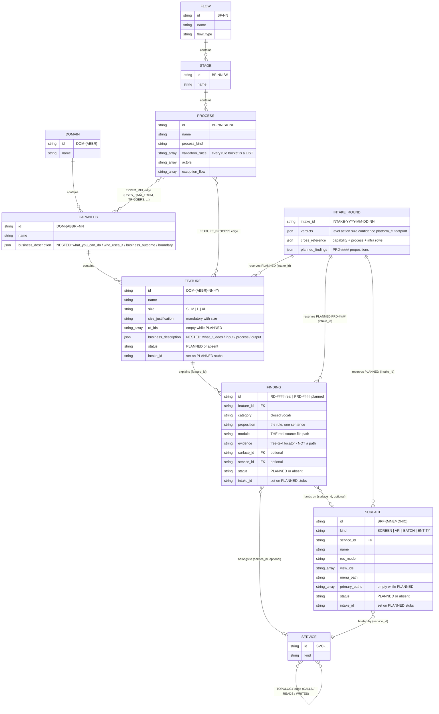

# DNA store — object model (assumed ERD)

> **In kiln:** this page is tps-project-dna v2.18.1's text, verbatim. The scripts and files it names
> are that project's; [reading-note.md](reading-note.md) says what each one is in kiln, and where
> the two disagree, kiln's commands win.

A navigation map of the entities in `_dna_store/` and how they connect. This is a REFERENCE
diagram for humans and agents reading the store — the enforcement source of truth remains
`build_dna_store.py` (CORE_FIELDS) + `check_gates.py`; if this page and those scripts ever
disagree, the scripts win and this page needs a fix.

Why this page exists: agents repeatedly guess field shapes and guess wrong (see Traps below —
every entry is a REAL incident). Read this before writing any query or script over the store.

## Diagram

## Entities (store file → key fields)

| Entity | File | Key fields (not exhaustive — CORE_FIELDS is) |
|---|---|---|
| DOMAIN | `domains.jsonl` | `id` (DOM-{ABBR}), `name` |
| CAPABILITY | `capabilities.jsonl` | `id` (DOM-{ABBR}-NN), `name`, `business_description` — **nested** `{what_you_can_do, who_uses_it, business_outcome, boundary}` |
| FEATURE | `features.jsonl` | `id` (DOM-{ABBR}-NN-YY), `name`, `size` + `size_justification`, `rd_ids`, `business_description` — **nested** `{what_it_does, input, process, output}`, optional `status: "PLANNED"` + `intake_id` |
| FINDING | `findings.jsonl` | `id` (RD-#### real / PRD-#### planned), `feature_id`, `category`, `proposition`, **`module` = the real source-file path**, **`evidence` = free-text locator inside that file (function names + line ranges — a sentence, NOT a path)**, optional `surface_id`/`service_id`, planned ones carry `status`/`intake_id` |
| PROCESS | `processes.jsonl` | `id` (BF-NN.S#.P#), rule buckets (each a LIST, never a bare string), actors, exception_flow |
| STAGE / FLOW | `stages.jsonl` / `flows.jsonl` | `id` (BF-NN.S# / BF-NN) |
| SURFACE | `surfaces.jsonl` | `id` (SRF-…), `kind` (SCREEN/API/BATCH/ENTITY), `service_id`, `res_model`, `view_ids`, `menu_path`, `primary_paths`, optional `status: "PLANNED"` + `intake_id`, `ext.pinned_feature_ids` |
| SERVICE | `services.jsonl` | `id` (SVC-…), `kind` |
| EDGE | `edges.jsonl` | `kind` + `from`/`to` (+ `type` for typed kinds) — see below |
| INTAKE_ROUND | `intakes.jsonl` (+ `_intake_ledger.json` upstream) | `intake_id` (INTAKE-YYYY-MM-DD-NN), verdicts, `cross_reference`, `planned_findings` |
| DEBT | `debts.jsonl` | kind/status closed vocab |

## Edge kinds (the `kind` field in `edges.jsonl`)

| kind | from → to | Meaning |
|---|---|---|
| `FEATURE_PROCESS` | process → feature (tolerate either order) | The feature participates in that process step — basis of the SHARES_STAGE neighbor channel |
| `TYPED_REL` | **process → capability**, `type` ∈ USES_DATA_FROM / TRIGGERS / INTEGRATES_WITH / CONTROLLED_BY / NOTIFIES_THROUGH / PRESENTED_BY / AUTHORIZED_BY / AUDITED_BY | Data/control relationship — NOT feature-to-feature |
| `REALIZES` | technical feature → business feature | abstraction_level satellite link |
| `CONTROLS` | control feature → controlled process | |
| `TOPOLOGY` | service → service, `type` ∈ CALLS / READS / WRITES | Service topology |
| `EXTERNAL_HOP` / `SURFACE_CALLS` / `PROCESS_SURFACE` | see check_gates closed sets | Derived infra edges (may be absent on a store that never ran those derivations) |

## Traps (each one is a real incident — do not repeat them)

1. **`FINDING.evidence` is a sentence, not a path list.** The real file path is `FINDING.module`
   (exactly one file per finding). A script that iterates the evidence string gets CHARACTERS;
   one that splits it on `:` gets garbage. (Incident: context_footprint v1 counted 67 "files"
   for a feature that really touches 4 — they were 67 distinct characters.)
2. **`business_description` is nested, and its keys differ by entity** — Capability uses
   `{what_you_can_do, who_uses_it, business_outcome, boundary}`, Feature/Surface use
   `{what_it_does, input, process, output}`. A flat `d.get('description')` /
   `d.get('what_it_does')` returns nothing, silently. (Incident: 6 capability lookups all came
   back empty in a live intake round.)
3. **`TYPED_REL` connects a PROCESS to a CAPABILITY** — there are no feature↔feature typed
   edges. Deriving feature neighbors from typed relations requires going through the feature's
   processes, and lands on capabilities (drill down deliberately, never auto-explode).
4. **Query with grep first** (`references/dna-store.md` Query cookbook) — custom read-loops with
   guessed field names are where every incident above started.
