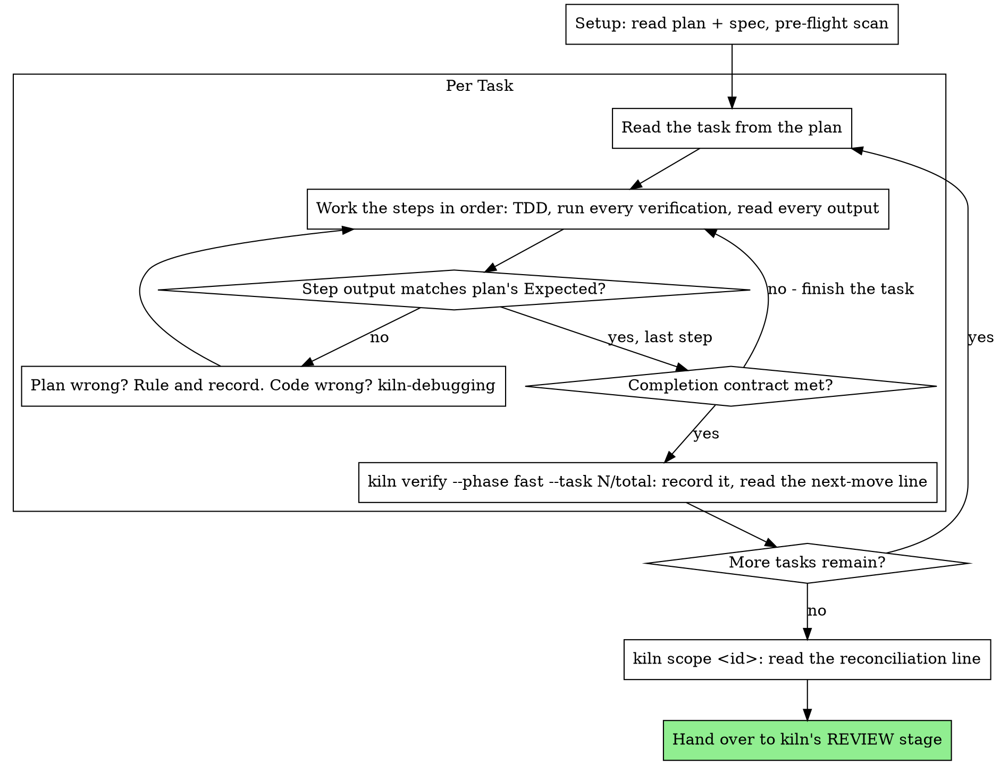

# Executing Plans

Execute the plan yourself, task by task, in this session: no implementer
subagent per task, no reviewer per task. One fresh-context review of the
whole branch at the end.

**Why inline:** Subagent-driven development pays for a fresh implementer
and a fresh reviewer on every task, each re-reading the codebase from zero.
Inline execution pays for one context (yours) plus one reviewer at the end.
What it gives up is a fresh context per task and a second pair of eyes per
task. This skill keeps what those two things bought, by other means: the
brief is the spec, the ledger is your memory, TDD is the per-task gate, and
the final reviewer is the second pair of eyes.

**Core principle:** The plan already did the thinking. Execute it exactly,
prove each step with a test you watched fail and then pass, and leave a
record that survives your own forgetting.

**Narration:** between tool calls, narrate at most one short line — the
ledger and the tool results carry the record.

**No summaries between tasks.** No table of completed tasks, no "Tasks 1-3 are
green" recap, no "Task 4 is next and is the largest". A summary is a closing
gesture and the turn ends on it: measured on a five-hour run, both unnecessary
stops came directly after a table, and both ended on a sentence promising to
continue. The promise did not survive the table. The ledger already holds what
a table would say, and `kiln report` renders it on request.

**Continuous execution:** Do not pause to check in with your human partner
between tasks. They chose inline execution to spend less, not to answer
"should I continue?" after every task. Execute all tasks from the plan
without stopping.

**Rulings, not stalls.** Conflicts, ambiguities, plan defects — decide them.
The spec is the binding authority, the plan is its argument, and your
judgment settles what neither answers. Record every decision in the ledger
(`.kiln/work/<id>/ledger.md`) as `Ruling: <what you decided> — <why> — <what
it costs if wrong>`, and keep going. Deviating from the plan without a ledgered ruling is a decision made
in secret.

Four things stop you, and only these: an irreversible or destructive
operation; a security-sensitive action; a side effect outside this worktree
that norms say you ask about first (a merge, a push to a shared branch, a
publish); and a plan so broken that every path forward is a guess. For
those, stop and ask.

Files `kiln practices` may name from here — agent-skills' own:
[incremental-implementation.md](incremental-implementation.md) (always: thin slices, one thing
at a time, safe defaults, rollback-friendly steps),
[source-driven-development.md](source-driven-development.md),
[doubt-driven-development.md](doubt-driven-development.md),
[ci-cd-and-automation.md](ci-cd-and-automation.md) and
[browser-testing-with-devtools.md](browser-testing-with-devtools.md) (it needs the Chrome
DevTools MCP server; without one, say the browser check was not run).

## When to Use

- The plan gate is approved and `plan.md` is the document it was approved against.
- Tasks are mostly independent.

A fully specified plan makes this transcription plus testing. The one place a more
capable model earns its cost is REVIEW, which kiln runs as its own stage after you
hand over — so the review this run buys is not yours to perform.

Over a long plan the last tasks get the least of you. `state.json` is what makes that
recoverable: it records where you are, and kiln re-checks it rather than believing it.

## The Process



## Setup

Work on the branch kiln opened. **Do not create a git worktree**: submodule layouts
and fixed absolute build paths cannot provide one, so kiln never requires it. Pushing to
a protected branch is blocked by a hook, not by your care.

**Do not commit while implementing.** SHIP is the run's one commit point: it stages an
explicit path list once the change has been reviewed and verified. A commit per task is
superpowers' and agent-skills' habit, not kiln's — BMAD commits once, at the end, and so does
kiln, because a spike's probe and a reviewed change both depend on nothing having been
committed behind the gates. Where a practice file says "commit", kiln's record is
`kiln verify --task`.

Conversation memory does not survive compaction. An inline executor that
loses its place re-implements tasks it already finished — the same
failure as a controller re-dispatching them, paid for in your own context.
Track progress in a ledger file, not only in todos. Harness todos are a
live view; the ledger is the record.

There are two records, and only one is yours to write:

- `.kiln/work/<id>/ledger.md` is **yours**: one line per task, and every `Ruling:`.
- `.kiln/work/<id>/state.json` is **kiln's**. You do not edit it — a hook blocks that,
  because enforcement must not read a file the enforced party can write. You write to it
  the way `kiln verify` does: by doing the thing and letting kiln record what it observed.
  - `state.verify[]` holds each step's id, command, **exit code**, and the commit range and
    tree it ran against. An entry for another tree is stale, not evidence.
  - `stage` and `step` say where you are. After a resume, kiln runs a cheap preflight
    rather than believing them — and so should you: check the tree against what the
    ledger claims before re-implementing anything.

Read the plan once, note its context and Global Constraints, and create a
todo per task. If the plan names a Spec, read that too: the spec is the
authority the plan argues from, and conflicts inside the plan resolve
against it. A plan with no reachable spec gets a ledger note saying so —
rulings made without one are provisional.

**REQUIRED SUB-SKILL:** load kiln-tdd now,
before Task 1. It governs every step of every task below; a plan whose
steps already say "write the failing test first" does not exempt you
from reading it.

**Start from a clean baseline.** Before Task 1, run the project's suite once:

```bash
node "${CLAUDE_PLUGIN_ROOT}/bin/kiln.mjs" verify <id> --phase full
```

superpowers runs the tests before any work "so later failures aren't ambiguous". If it is red
before you have changed anything, that is not yours to fix silently: record it in the ledger
and halt with `kiln halt <id> --kind blocking_unknown --reason "<which tests fail at the base>"`,
so your human partner decides whether to proceed.

Then run `node "${CLAUDE_PLUGIN_ROOT}/bin/kiln.mjs" practices <id> --stage implement` and read
every file it prints before Task 1.

Before Task 1, scan the plan for conflicts between tasks. The plan's
Interfaces blocks tell you where to look: for every task that consumes
what an earlier task produces, one ledger row — the two tasks, what one
produces against what the other consumes, and what you found. Tasks that
share nothing get no row; a plan whose tasks share nothing gets the single
line `Pre-flight: no shared interfaces`. Rule on each conflict a row
surfaces with the spec as the binding authority, record the ruling beside
its row, and start Task 1. Each task's own text is checked when you read
its brief, not here.

## The Task Loop

Everything you print, and every tool result, stays resident in your
context for the rest of the session. Redirect long test output to a file
under `.kiln/tmp/<id>/` and read its tail; read one task, not the whole plan.

### 1. Take the task

- Read the task from `plan.md` in full, including ones you remember from setup: what
  you remember is a summary, the plan has the exact values, signatures and test cases.
- Mark the task's todo in_progress.

Every tool call is a turn that re-reads your whole context. Bookkeeping
rides along with work — a ledger append in the same call as the task's last
step, never in a call of its own.

### 2. Work the steps

The plan's steps are already in RED-GREEN order; follow them in that
order under kiln-tdd, loaded at setup. A test
step's code is written first and run first. Watching it fail is a step,
not a formality — a test that passes before the implementation exists is
a finding about the test.

Every step that runs a command has an `Expected:` line. Run the command,
read its output, and compare. Three outcomes:

- **Matches.** Next step.
- **The code is wrong.** Use kiln-debugging. Find the
  cause; never patch the symptom to make the step's output match.
- **The plan is wrong** — a step contradicts the spec, an interface from an
  earlier task doesn't match what this task consumes, a command that
  cannot work. Rule on the smallest change that satisfies the spec, ledger
  it as `Task <N>: Ruling: <finding> — <what you decided and why>`, and
  continue. The ruling is carried, not remembered: later tasks that touch
  the same interface read it from the ledger.

A plan step that says "commit" is skipped, and the ledger says so once. The
review range is cut from the work's base, never `HEAD~1`.

### 3. The completion contract

Before a task is complete, all of the following are true, with evidence
in this session — not inferred from the diff looking right:

- Every test the brief names exists and ran in this task, and you read
  the output.
- The final test run for the task passed — `kiln verify --phase fast` is that run, and
  it records the command and the exit code.
- Every `Expected:` line in the brief was compared against real output.
- Every deviation from the plan has a `Ruling:` line in the ledger.

The claim is governed by the record, not by recollection: if `state.verify[]` does not
hold a green run for this task's command in the current range, the task is not complete.
Finish it.

### 4. Complete the task

Run

```bash
node "${CLAUDE_PLUGIN_ROOT}/bin/kiln.mjs" verify <id> --phase fast --task <N>/<total>
```

It runs the
tests, keeps the full output under `.kiln/tmp/<id>/steps/`, and records each
step's exit code and the tree it ran against. Then append the task's line to
your ledger, in the same turn:

`Task <N>: complete (tests: <command> → exit <code>)`

A failing run is recorded as a failure; the task is not complete.

A passing run also takes a **snapshot** of the tree (`task/<N>`); the plan gate took
`task/0`. If a later task breaks what an earlier one had passing and editing forward is not
the fix, go back with `kiln restore <id> --to task/<N>` — never `git checkout`, `restore` or
`reset`, which kiln refuses while the work is open. The restore takes an undo snapshot first
and prints how to return. If the project has no fast phase, record each task with
`--phase full --task <N>/<total>` instead.

`--task <N>/<total>` is not decoration. kiln records the position and its last
line tells you what to do next. **Read that line and do it in the same turn.**
It is the instruction; this document is five hours behind it.

## Handing over to REVIEW

When the last task's record is written, stop. kiln's REVIEW stage is the fresh pair of
eyes this run buys, and it is not yours to perform: the same author has the same blind
spots. Before handing over, run

```bash
node "${CLAUDE_PLUGIN_ROOT}/bin/kiln.mjs" scope <id>
```

and read the `Scope —` line. Divergence is reported, not blocked — discovery during
implementation is legitimate. A diff of **zero files** halts, and its usual cause is a
commit on another branch.

**Before handing over**, in this order — source closes after the review gate, so anything
that could need an edit happens here:

1. **Simplify** the diff this work made, following [code-simplification.md](code-simplification.md):
   behaviour unchanged, tests green after each step.
2. **Check every claim** you are about to make, following
   [verification-before-completion.md](verification-before-completion.md): the plan's
   requirements line by line, a regression test proved by undoing the fix (it must fail) and
   restoring it, and no "should" or "probably".
3. **The definition of done**, [definition-of-done.md](definition-of-done.md): every item met,
   or the gap written in the handover.

**The Matrix Test Audit** (BMAD). If the plan has an I/O & Edge-Case Matrix, verify every
matrix row is covered by at least one test that verifies its expected behavior, and that
each covering test ran and passed in the verification output. A covering test that exists
but did not run — unregistered, filtered out, skipped, or disabled — counts as missing. If a
test disagrees with the matrix, never edit the expectation to match the code: fix the code,
or if the matrix row itself is ambiguous, halt and ask your human partner
(`kiln halt <id> --kind blocking_unknown --reason "<the row>"`). Fix any other audit
failure before handing over.

Collect every `Ruling:` you made into your handover, in the order you made them, each
with what it costs if wrong. Your handover is the only place decisions you took on your
human partner's behalf reach them.

## Common Rationalizations

| Excuse | Reality |
|--------|---------|
| "I remember what Task N says" | You remember a summary. The brief has the exact values. Read it. |
| "The plan's code is right, skip watching the test fail" | A test you never saw fail proves nothing. It is one step. Run it. |
| "I'll run the full suite at the end instead of per step" | Per-step runs are how you learn which step broke it. The end-of-task run is the contract, not a substitute. |
| "The plan is wrong here, I'll just do the right thing" | Do the right thing and ledger the ruling. Unledgered deviation is a decision made in secret. |
| "I'll write the ledger lines after a few tasks" | Compaction does not wait for a convenient moment. One line per task, in the same turn as its last step. |
| "The plan says commit here" | SHIP commits, once, with the paths named. A commit mid-run is a record nobody reviewed yet. |
| "Let me check in before the next task" | They chose inline to spend less. Progress prompts spend their time instead. Only the four stops stop you. |
| "I read my own diff carefully; the final reviewer is redundant" | Same author, same blind spots. The reviewer is the only fresh context this run buys. |
| "Tests should pass, the change was trivial" | "Should" is not evidence. The contract requires the command and its output. |
| "Subagents are slow and expensive, I'll skip the final review too" | Inline already removed the per-task reviewers. One review of the whole branch is the floor, not the ceiling. |
| "The reviewer said Minor, so it's Minor" | The label graded the spec's silence. Grade what the person gets. Re-grade, then gate. |
| "The fix is obvious, no need for a failing test first" | The failing test is the only proof the finding was real and is now gone. Without it you have a diff and a hope. |
| "I'll fix the minors too while I'm in there" | Every minor you fix is a test, a fix, and a suite run your partner did not ask for. Ledger them; your partner decides. |

## Example Workflow

```
You: I'm using the kiln-implement skill to work this plan.

[Read plan once: .kiln/work/42/plan.md; spec read]
[Pre-flight scan: 2 shared-interface rows, 4 self-consistency rows, clean; recorded]
[Create todos for all tasks]

Task 1: Hook installation script

[Read Task 1 from the plan]
[Step 1: write failing test — written]
[Step 2: run it — FAIL: install_hook not defined. Matches Expected.]
[Step 3: implement — written]
[Step 4: run it — PASS 1/1. Matches Expected.]
[Step 5: commit — skipped: SHIP commits]
[Contract: tests ran, output read, no deviations]
[kiln verify 42 --phase fast --task 3/8 → pass unit exit 0 — recorded; "Task 4 is next — do not stop"]

Task 2: Recovery modes

[Read Task 2]
[Step 2: run failing test — FAIL, but on an import error: Task 1 exported
 installHook, the plan consumes install_hook]
[Ruling: the plan's consumer name is a typo against Task 1 Produces; use installHook
 — ledger: Task 2: Ruling: install_hook → installHook — cost if wrong: one rename]
[Steps 2-4 as planned]
[kiln verify 42 --phase fast --task 4/8 → pass unit exit 0]

...

[After all tasks: kiln scope 42]
Scope — predicted 4 · actual 5 · ⚠ 1 beyond prediction
  beyond: src/recovery/retry.ts

Rulings I made:
- Task 2: install_hook → installHook (plan typo; cost if wrong: one rename)

Handing over to REVIEW. The scope line is reported, not blocked — retry.ts was
discovered while implementing Task 2 and is named above.
```

## Red Flags

- You are about to edit source and no gate is recorded as approved. The hook will stop
  you; go back to the gate rather than looking for another way to write the file.
- You are about to say the tests pass without `kiln verify` having recorded an exit code.
- You deviated from the plan and the reason lives only in your head.
- You are about to create a git worktree.
- You are re-implementing a task because a checkbox said it was not done.
- A `fast` pass came back clean and you are about to call the change green.

## Verification

Before handing over to REVIEW:

- [ ] Every task has a green `kiln verify --phase fast --task <N>/<total>` record.
- [ ] Nothing was committed: the change is in the working tree, for SHIP to commit.
- [ ] Every `Expected:` line was compared against real output you read.
- [ ] Every deviation has a `Ruling:` in the ledger, with what it costs if wrong.
- [ ] `kiln scope <id>` ran and its line is in your handover.
- [ ] You did not perform the review yourself.
